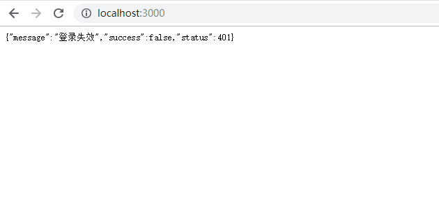

# node + koa + mongodb + vue学习

## 启动
1. 启动数据库mongodb, 进入cd /usr/local/mongodb/bin, sudo ./mongod启动数据库
2. 进入server目录，node start
## 学习点
---

功能点|技术点|其它
---|:---:|---:
登录 、退出、注册|vue、vuex、vue router、element UI|前端打包、测试、ssr、单点登录
增、删、改、查|node、koa、jwt、router、mongodb(robomongo)|后端预览、postman、mocha单元测试
## 学习问题
  ---
  1. 打包 client -> server

      client 添加vue.config.js 里面配置outputDir

  2. 页面渲染和接口请求问题(暂未解决，输入localhost:8080/login依然有问题)
      ```
      .use(views(__dirname + '/views', {
        extension: 'ejs'
      }))
      ```
        以上方式会出现的问题是浏览器输入localhost:8080,此时不是浏览器渲染，而是接口请求，会进入中间件。其结果如下图所示

      
  
  3. 使用jwt，当authorization失效时的处理方式是采用中间件统一处理
  4. node 使用es6语法 import require（babel 相关插件添加）
  5. router.routes() 
  6. postman port  -> front port -> not backend port 
  7. postman 'content-type': 'application/x-www-form-urlencoded', post 		ctx.request.body才可以拿到数据 

		常用content-type | 使用场景|
		:---:             |:---: |
		multiple/form-data |发送file文件包，会附带boundary用于分割数据,如图片传输 |
		application/x-www-form-urlencoded |普通form表单提交，或js发包 |
		application/json|发送json格式数据 
  
  8. postman: get / post

## 待完成(2018.12.1)
   1. ~~注册功能~~
   <!-- 2. content-type, get/post等方式发送数据，后台获取参数的方式 -->
   3. [jwt 深入学习，以及401怎么返回比较合适](http://www.ruanyifeng.com/blog/2018/07/json_web_token-tutorial.html)
   4. [import require学习](http://imweb.io/topic/582293894067ce9726778be9)，[另一个链接](https://chenshenhai.github.io/koa2-note/note/other/esm.html)
	 写出require中间件的方法

		类型 | 导入 | 导出
		---: | ---: | ---:
		ES6 | import(编译) | export
		commonJS | require(运行) | module.exports
   5. node router学习
   6. 测试
		[前端测试](https://hk.saowen.com/a/e4b066f8c8d0f7164a93e01a8b98a1b26b20743581a8e6c999002c744e1b417f)：
			a: 安装@vue/cli-plugin-unit-mocha、@vue/test-utils、chai
			b: eslint屏蔽mocha报错，在eslintConfig中的env添加mocha: true
			c: 测试默认文件是tests/unit下的*.spec.js
			
   7. [ssr](https://ssr.vuejs.org/zh/#%E4%BB%80%E4%B9%88%E6%98%AF%E6%9C%8D%E5%8A%A1%E5%99%A8%E7%AB%AF%E6%B8%B2%E6%9F%93-ssr-%EF%BC%9F)

	 		7.1: 什么是ssr
			 
			7.2: 为什么使用ssr
				a.更好的SEO，由于搜索引擎爬虫抓取工具可以直接查看完全渲染的页面(如果SEO对你的站点比较重要，而页面是通过异步获取，此时选SSR解决)
				
				如果服务端渲染只是简单的为了改善页面的SEO，此时需要采用的是预渲染，无需使用web服务器动态编译HTML，采用预渲染方式，在构建时针对特定路由生成简单的静态HTML文件。设置预渲染更简单，可以将前端作为一个静态站点
				
				b.渲染更快（缓慢的网络或缓慢的设备，选SSR解决）
				
   8. 单点登录
	 9. oauth2(https://github.com/login/oauth/authorize?client_id=&scope=user,public_repo)
      首先：在页面会有对应的连接定位到github登录页，连接中含有client_id

 
